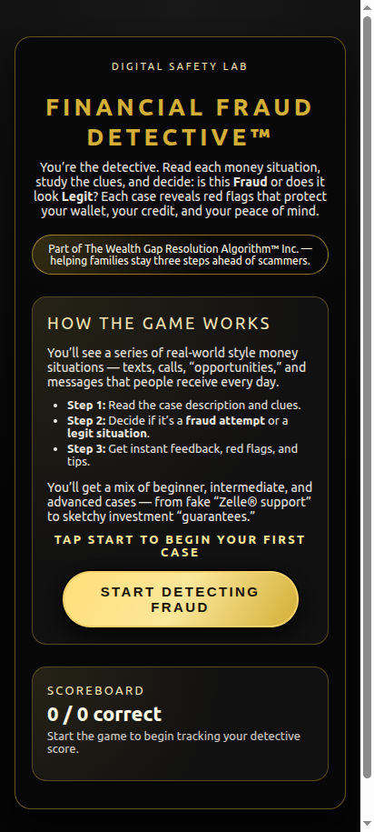
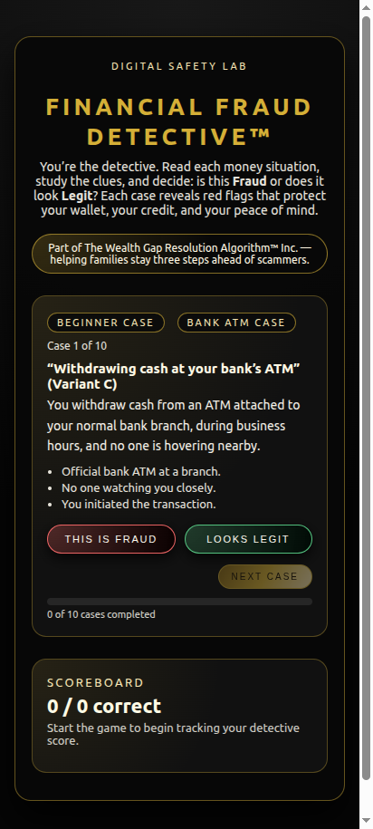
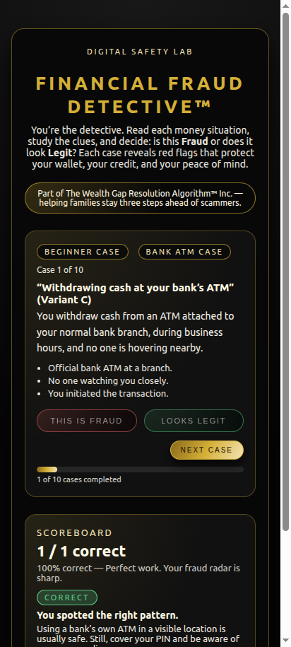
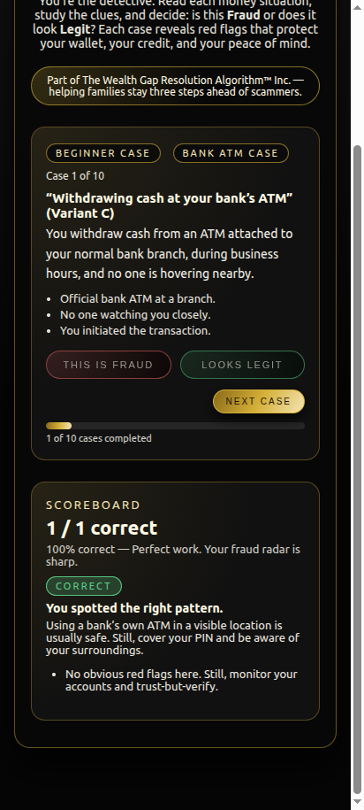
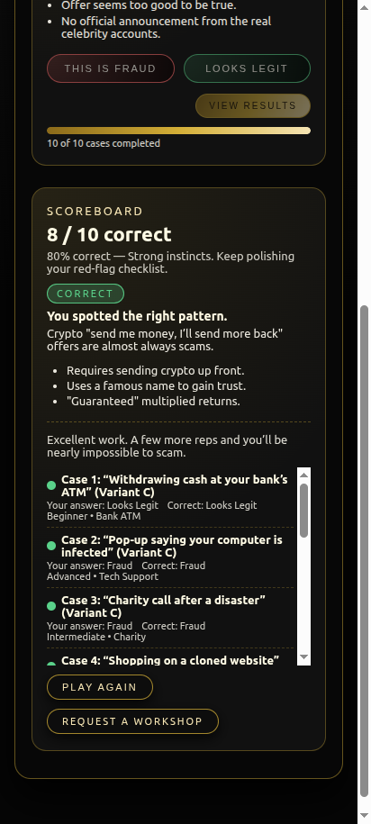

# WGRALGO Financial Fraud Detective

Financial Fraud Detective is a free educational Android app from **The Wealth Gap Resolution Algorithm™ Inc.** It helps users practice spotting scams, phishing attempts, suspicious money requests, fake support messages, and other financial fraud red flags through interactive case-based gameplay.

Play the role of a detective. Read each real-world style money situation, study the clues, and decide if it's **Fraud** or **Looks Legit**. Each case reveals red flags that protect your wallet, your credit, and your peace of mind.

This is an educational fraud-awareness game for people who want to stay three steps ahead of scammers — without subscriptions, ads, accounts, trackers, or cloud uploads.

## Features

- 10-case sessions drawn at random from a 100+ case pool
- Difficulty levels: **Beginner**, **Intermediate**, **Advanced**
- Case categories: Text / Message / Phone Call / Email / Investment Offer / Payment App / Job Offer / Bank Alert
- Two-button gameplay: **Fraud** or **Looks Legit**
- Instant feedback with red-flag explanations and protective tips
- Live scoreboard, progress tracking, and Play Again
- Final detective rating:
  - 90%–100% — Master Fraud Detective
  - 75%–89% — Sharp Investigator
  - 60%–74% — Red Flag Rookie
  - Below 60% — Needs More Case Work
- Premium WGRALGO black-and-gold UI, tablet and phone responsive
- Offline-first, no permissions required, no account, no cloud

## Privacy & Offline

WGRALGO Financial Fraud Detective is offline-first.

- No ads.
- No account.
- No analytics.
- No trackers.
- No subscription.
- No cloud sync and no backend server.
- All gameplay stays on your device.
- The APK does **not** request the Android `INTERNET` permission.

See [PRIVACY.md](PRIVACY.md) for the full privacy statement.

## Installation (Sideloading)

1. Download `WGRALGO_Financial_Fraud_Detective_v1.0.0.apk` from the [v1.0.0 release](../../releases/tag/v1.0.0).
2. (Optional) Verify the download:
   ```
   sha256sum -c WGRALGO_Financial_Fraud_Detective_v1.0.0.apk.sha256
   ```
3. On your Android device, allow installation from unknown sources for your browser or file manager.
4. Open the APK and install.

> **If you installed an earlier test/debug build:** you may need to **uninstall the old APK first** before installing v1.0.0. The official public APK uses a new proper release signature, and Android will refuse to install over a build signed with a different key.

## Build from Source

Requirements:
- Node.js 18+
- Android SDK (with build-tools and platforms)
- JDK 17

```
git clone https://github.com/WGRALGO/WGRALGO-Financial-Fraud-Detective.git
cd WGRALGO-Financial-Fraud-Detective
npm install
npx cap sync android
cd android
./gradlew assembleRelease
```

A release keystore is required for a signed APK. Create one and reference it via `android/keystore.properties`:

```
storeFile=/absolute/path/to/your-release.jks
storePassword=YOUR_PASSWORD
keyAlias=YOUR_ALIAS
keyPassword=YOUR_PASSWORD
```

The signed APK will be at `android/app/build/outputs/apk/release/app-release.apk`.

## Screenshots

| Home | Case View | Feedback |
|------|-----------|----------|
|  |  |  |

| Scoreboard | Results | How It Works |
|------------|---------|--------------|
|  |  |  |

## Disclaimer

Financial Fraud Detective is for **educational awareness only**. It does not provide legal, financial, banking, cybersecurity, or fraud-investigation advice. If you believe you are the victim of fraud, contact your financial institution, relevant authorities, or a qualified professional.

Real fraud schemes evolve constantly. The cases in this app are illustrative patterns; real-world situations may look different. Always verify suspicious messages through the official channel of the company or institution they claim to be from.

Where real companies or services are mentioned, they are referenced only as plain educational text. All trademarks belong to their respective owners.

## License

This project is released under the **GNU General Public License v3.0 (GPL-3.0-only)**. See [LICENSE](LICENSE).

Third-party dependencies remain under their own licenses — see [THIRD_PARTY_NOTICES.md](THIRD_PARTY_NOTICES.md).

## Credits

Created and maintained by **WGRALGO / The Wealth Gap Resolution Algorithm™ Inc.**

Project direction, testing, and public release decisions by **Richard "Rich" BlackMan / WGRALGO**.

Original web concept and educational content assistance by **ChatGPT by OpenAI**.

Android APK build, source cleanup, and GitHub packaging assistance by **Claude Code by Anthropic**.

See [CONTRIBUTORS.md](CONTRIBUTORS.md).

## Links

External websites are separate from the APK and may have their own privacy policies. The APK itself contains no external links, social media links, or donation links.

- Project page: https://thewealthgapresolutionalgorithm.org/financial-fraud-detective/
- Security reports: see [SECURITY.md](SECURITY.md)
