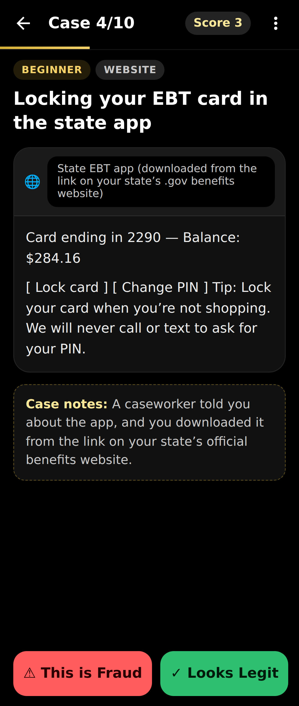
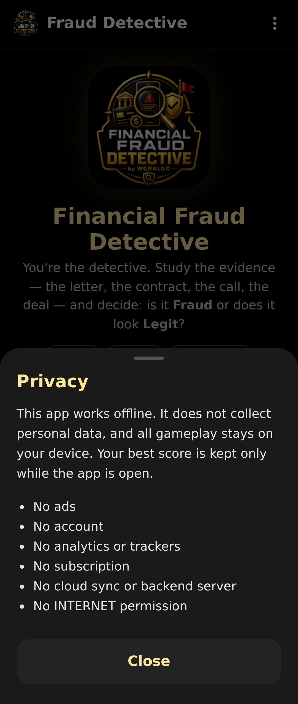

# WGRALGO Financial Fraud Detective

**Version: 2.0.0**  
**Devices:** phones and tablets, portrait and landscape

Financial Fraud Detective is a free educational Android app from **The Wealth Gap Resolution Algorithm™ Inc.** It helps users practice spotting scams, phishing attempts, suspicious money requests, fake support messages, and other financial fraud red flags through interactive case-based gameplay.

Play the role of a detective. Read each real-world style money situation, study the clues, and decide if it's **Fraud** or **Looks Legit**. Each case reveals red flags that protect your wallet, your credit, and your peace of mind.

This is an educational fraud-awareness game for people who want to stay three steps ahead of scammers — without subscriptions, ads, accounts, trackers, or cloud uploads.

## Features

- 45 realistic cases on money traps that go beyond everyday scam texts:
  identity theft, cars, contractors, loans, credit and debt, taxes, benefits,
  immigration and legal help, cards and checks, home and property, and small business
- Evidence shown the way you'd really see it: text threads, emails (with the
  real link behind the button), phone-call transcripts, web pages, mailed
  letters, and in-person situations
- Balanced 10-case rounds: 4 beginner, 4 intermediate, 2 advanced, and
  5 fraud + 5 legit, so guessing "fraud" every time won't work
- Two-button gameplay: **This is Fraud** or **Looks Legit**
- After each answer: the red flags (or why it checks out) and **what to do in real life**
- Live score, streaks, and progress bar
- Results with a detective rank (Rookie Detective → Chief Detective), your weak
  spots by category, and an expandable case file of every answer
- Native-style app design: app bar, bottom action buttons, slide-up About,
  Privacy, and Credits sheets
- Offline-first, no permissions required, no account, no cloud

## Privacy & Offline

WGRALGO Financial Fraud Detective is offline-first.

- No ads.
- No account.
- No analytics.
- No trackers.
- No subscription.
- No cloud sync and no backend server.
- All gameplay stays on your device. Your best score is kept only while the app is open.
- The APK does **not** request the Android `INTERNET` permission.

See [PRIVACY.md](PRIVACY.md) for the full privacy statement.

## Installation (Sideloading)

1. Download `WGRALGO-FinancialFraudDetective-v2.0.0.apk` from the
   [v2.0.0 release](../../releases/tag/v2.0.0).
2. (Optional) Verify the download with the `.sha256` file attached to the release:
   ```
   sha256sum -c WGRALGO-FinancialFraudDetective-v2.0.0.apk.sha256
   ```
3. On your Android device, allow installation from unknown sources for your browser or file manager.
4. Open the APK and install.

> **Have v1.0.0 installed? Uninstall it first.** v1.1.0 is signed with a new
> release key, so Android will refuse to install it over v1.0.0. The app
> stores no accounts or personal data, so uninstalling loses nothing. Later
> updates will install over v1.1.0 normally.

Release signing certificate from v1.1.0 onward
(`CN=WGRALGO, OU=Financial Fraud Detective`), SHA-256 fingerprint:

`0E:F1:3A:04:FC:3D:36:B6:D7:BA:7D:32:53:C1:FD:59:EC:56:D7:E1:AC:0B:5E:C2:C2:30:03:50:24:6F:7B:9A`

Check it with `apksigner verify --print-certs WGRALGO-FinancialFraudDetective-v2.0.0.apk`.

## Build from Source

Requirements:
- Node.js 18+
- Android SDK (with build-tools and platforms)
- JDK 17

```
git clone https://github.com/WGRALGO/WGRALGO-Financial-Fraud-Detective.git
cd WGRALGO-Financial-Fraud-Detective
npm install
npx cap sync android
cd android
./gradlew assembleRelease
```

A release keystore is required for a signed APK. Reference it with
`android/keystore.properties` (git-ignored):

```
storeFile=/absolute/path/to/your-release.keystore
storePassword=YOUR_PASSWORD
keyAlias=YOUR_ALIAS
keyPassword=YOUR_PASSWORD
```

or with the environment variables `FFD_KEYSTORE_FILE`, `FFD_KEYSTORE_PASSWORD`,
`FFD_KEY_ALIAS`, and `FFD_KEY_PASSWORD`.

The signed APK will be at `android/app/build/outputs/apk/release/app-release.apk`.
Run `npm run validate` (or `npm run validate -- path/to/app.apk`) to check a release.

### Publishing a release from GitHub

The **Android Signed Release** workflow (`.github/workflows/release.yml`)
builds, signs, validates, and publishes the APK to GitHub Releases. It reads
the keystore from repository secrets (Settings → Secrets and variables →
Actions): `FFD_KEYSTORE_BASE64` (the keystore, base64-encoded),
`FFD_KEYSTORE_PASSWORD`, `FFD_KEY_ALIAS`, and `FFD_KEY_PASSWORD`. Bump the
version in `package.json`, `android/app/build.gradle`, and the app footer,
add `release-notes/v<version>.md`, then run the workflow from the Actions tab
on `main`.

## Screenshots

Captured from v1.1.0 at Android phone size (360dp wide, 1080×2547 PNG).

| Home | Case | Feedback |
|------|------|----------|
|  |  |  |

| Evidence: web page | Results | Privacy |
|--------------------|---------|---------|
|  |  |  |

## Disclaimer

Financial Fraud Detective is for **educational awareness only**. It does not provide legal, financial, banking, cybersecurity, or fraud-investigation advice. If you believe you are the victim of fraud, contact your financial institution, relevant authorities, or a qualified professional.

Real fraud schemes evolve constantly. The cases in this app are illustrative patterns; real-world situations may look different. Always verify suspicious messages through the official channel of the company or institution they claim to be from.

Where real companies or services are mentioned, they are referenced only as plain educational text. All trademarks belong to their respective owners.

## License

This project is released under the **GNU General Public License v3.0 (GPL-3.0-only)**. See [LICENSE](LICENSE).

Third-party dependencies remain under their own licenses — see [THIRD_PARTY_NOTICES.md](THIRD_PARTY_NOTICES.md).

## Credits

Created and maintained by **WGRALGO / The Wealth Gap Resolution Algorithm™ Inc.**

Project direction, testing, and public release decisions by **Richard "Rich" BlackMan / WGRALGO**.

Original web concept and educational content assistance by **ChatGPT by OpenAI**.

Android APK build, source cleanup, and GitHub packaging assistance by **Claude Code by Anthropic**.

See [CONTRIBUTORS.md](CONTRIBUTORS.md).

## Links

External websites are separate from the APK and may have their own privacy policies. The APK itself contains no external links, social media links, or donation links.

- Project page: https://thewealthgapresolutionalgorithm.org/financial-fraud-detective/
- Security reports: see [SECURITY.md](SECURITY.md)
